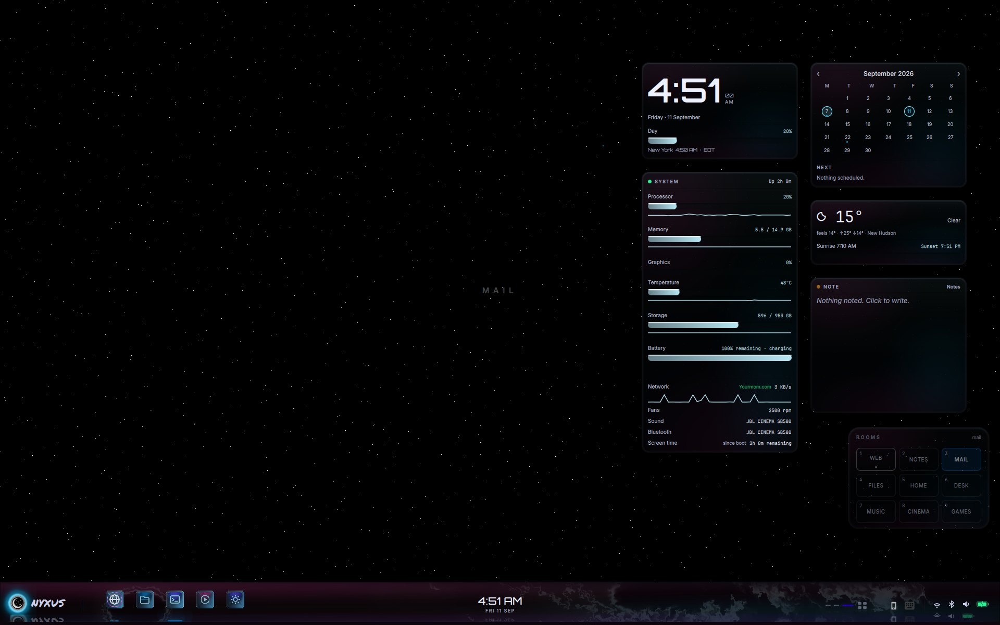

# Nyxus Suxyn

**Daily-driver desktop for one Alienware.** Hyprland compositor. Quickshell chrome. Starlight sky, a living bar, glass session lock.

**Live page (open this on a phone too):** https://ikswognereisj-ctrl.github.io/Nyxus-Suxyn/

## Build

| | |
|---|---|
| Product | Nyxus Suxyn |
| Image | `nyxus-suxyn` **2026.09.02** |
| Chassis | Alienware 15 DA15265 · 1920×1200 @ 165 Hz · scale 1 |
| Compositor | Hyprland 0.56.2 · blur off |
| Shell | Quickshell 0.3.1 |
| Sky | Starlight (twinkling field) |

This repository is **this machine’s shell**. It is not Nyxus-Core, not another PC, and not personal apps.

## Layout

| Path | What |
|---|---|
| `quickshell/` | Bar, Start, lock, flyout, Settings, widgets, Nyxus apps |
| `hypr/` | Hyprland, hyprlock, hypridle, walls |
| `gtk-3.0/` `gtk-4.0/` | Font rendering |
| `ghostty/` | Terminal font |
| `docs/` | Showcase page |
| `tools/` | GTK-login pin and snapshot repair |

## Language

Glass is furniture (Pane + swell + a 1 px glacier seam). Crystal is identity icons. Magma (`#ff7847`) is what matters. The live sky is Starlight; stills live in Settings ▸ Background.

Reload the shell with `qs ipc call nyxus reload`. Shader pipeline changes need a targeted `SIGTERM` of the Quickshell process.

## Not in this repo

ISO builder, other machines, personal apps, local AI, and security-stack tools.
