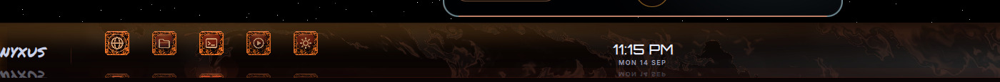
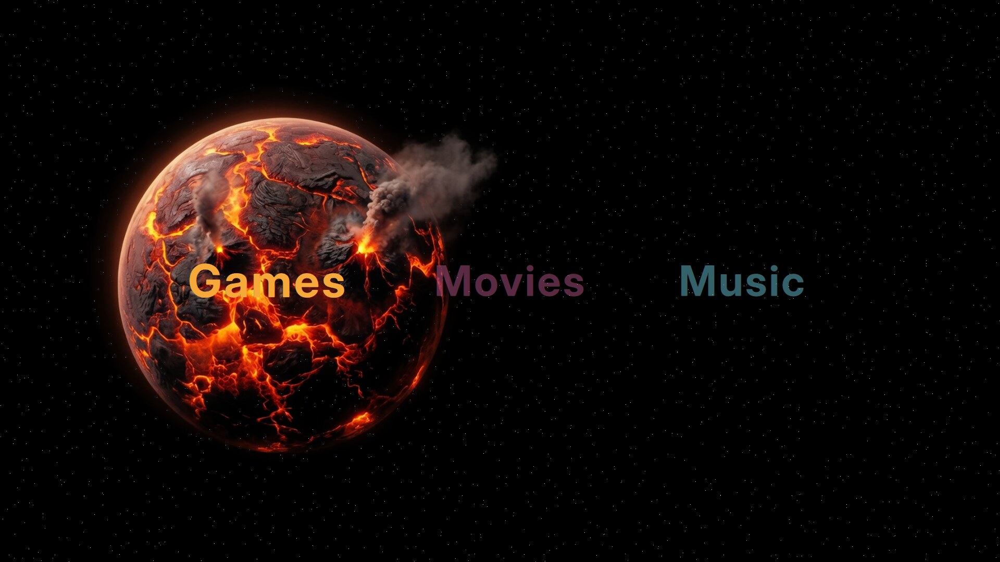

# Nyxus Suxyn

**A complete Linux desktop — Hyprland compositor, Quickshell chrome, a
shader sky, a living bar, and two full themes you can switch between
with one toggle.**

Not a theme pack. Not a dotfiles dump. A shell, its 196 supporting
programs, a Calamares installer, and an ISO builder that turns all of it
into something you can hand to someone else.

**Live page:** <https://ikswognereisj-ctrl.github.io/Nyxus-Suxyn/>

[](https://ikswognereisj-ctrl.github.io/Nyxus-Suxyn/)

---

## Two themes, one switch

Nyxus ships **two complete looks**. Not an accent-colour slider — two
distinct visual languages, each carried through every surface: bar, dock,
lock screen, launcher, flyouts, Settings, widgets, wallpaper and shaders.

| | |
|---|---|
| **ICE** | Pale glacier and plum. Cold, precise, high-contrast. |
| **MAGMA** | Volcanic glass and ember, with pale glacier used as a *second light* for definition. |

Switch in **Settings → Appearance**. The toggle writes five coordinated
keys at once — palette, swirl, sky mode and wallpaper base — so the
wallpaper can never desynchronise from the theme. The choice survives
logout and reboot.



*MAGMA: faceted volcanic-glass dock tiles with live reflections, a
spectrum visualizer driven by real audio, and the sigil sharing one
contact line with the dock.*



*The Floor hub. It deliberately wears both theme layers at once.*

---

## What's in the box

| | |
|---|---|
| **Shell** | 205 QML files, ~90,000 lines, 33 fragment shaders |
| **Tooling** | 196 `nyxus-*` programs — media, brightness, backup, lyrics, diagnostics, wallpaper, voice, updates |
| **Installer** | Calamares, with FDE and hibernate wiring |
| **ISO** | `iso-builder/` — a full ArchISO profile and bake script |
| **Themes** | ICE and MAGMA, complete |
| **Compositor** | Hyprland 0.56.2 |
| **Shell runtime** | Quickshell 0.3.1 |

### Highlights

- **A live bar** — clock, media crest with real MPRIS control, an
  audio-reactive spectrum visualizer, system tray, network, Bluetooth,
  battery, and a dock with true live reflections.
- **Real reflections.** The dock does not mirror a static image; it
  captures the lit, shaded tile every frame.
- **A shader sky** — Starlight, with a layered wallpaper system.
- **Desktop widgets** — clock, vitals, sticky notes, calendar, weather,
  now-playing. Individually toggleable, freely placeable.
- **Session lock and screensaver** with art, weather and now-playing.
- **Nyxus apps** — files, media, calendar, notes, calculator, reader,
  viewer, system monitor, and a Floor hub for games, movies and music.
- **Night mode, focus mode, quiet hours, game mode.**
- **Multi-monitor** throughout, including per-screen bar behaviour.

---

## Install

### From the ISO

Bake it, boot it, run the installer. Calamares handles partitioning,
full-disk encryption and hibernate setup.

```bash
sudo iso-builder/build-iso.sh
```

The bake **fails loudly** rather than producing a quietly broken image:
it verifies that every `nyxus-*` binary referenced by the installer, and
every command the shell actually spawns, is present in the image.

### On an existing system

On a machine that already has `git` and the
[stack it expects](DEPENDENCIES.md):

```bash
curl -fsSL https://ikswognereisj-ctrl.github.io/Nyxus-Suxyn/get.sh | bash
```

That clones to `~/src/Nyxus-Suxyn` and runs a pre-flight diagnostic. To
then deploy to the current user (a timestamped backup is made first):

```bash
~/src/Nyxus-Suxyn/tools/apply-shell.sh
```

This installs the shell **and** the 196 supporting programs to
`~/.local/bin`. It warns if that directory is not on your `PATH`.

Prefer to inspect first? Clone by hand and run the pieces yourself:

```bash
git clone --depth 1 https://github.com/ikswognereisj-ctrl/Nyxus-Suxyn.git ~/src/Nyxus-Suxyn
~/src/Nyxus-Suxyn/tools/apply-shell.sh --preflight-only   # diagnose, change nothing
~/src/Nyxus-Suxyn/tools/apply-shell.sh                    # deploy, with rollback snapshot
```

## Update

```bash
~/src/Nyxus-Suxyn/tools/update-shell.sh
```

Pulls the latest commit (fast-forward only — local edits in the clone are
never discarded) and re-runs the deploy, which re-checks pre-flight
conditions and writes a fresh rollback snapshot before touching
`~/.config`. To only check whether an update exists:

```bash
~/src/Nyxus-Suxyn/tools/update-shell.sh --check
```

## Rollback

Every deploy snapshots the previous `~/.config/quickshell` and
`~/.config/hypr` to `~/.local/share/nyxus/shell-bak-<timestamp>/` with a
`RESTORE.txt` beside them. Restoring is copying the snapshot back — the
exact commands are written into that file at deploy time.

---

## Hardware

Developed on an Alienware 15 (`eDP-1` 1920×1200 @ 165 Hz) plus an
external head, and that is where it is best tested. Machine-specific
values ship commented out with generic fallbacks, and hardware detection
runs at install time.

It is no longer *scoped* to one machine — the tooling is vendored, paths
resolve the invoking user's home rather than a hardcoded account, and the
ISO stages everything it needs. If you hit something that still assumes
this laptop, that is a bug worth reporting.

---

## Layout

| Path | What |
|---|---|
| `quickshell/` | Bar, Start, lock, flyout, Settings, widgets, Nyxus apps, shaders |
| `bin/` | The 196 `nyxus-*` programs the shell calls |
| `hypr/` | Hyprland, hyprlock, hypridle, hyprpaper, monitor rules, walls |
| `iso-builder/` | ArchISO profile and the bake script |
| `installer/` | Calamares branding and modules |
| `tools/` | `apply-shell.sh` (deploy), `update-shell.sh` (update), `preflight-shell.sh` (diagnose), login repair helpers |
| `gtk-3.0/` `gtk-4.0/` | Font rendering and dark-theme defaults |
| `ghostty/` | Terminal palette and font |
| `docs/` | Showcase page, `get.sh`, and the build audit |

---

## Working on the shell

Reload with `qs ipc call nyxus reload`.

**Shader changes need more than a reload.** Edit the `.frag`, rebuild,
copy both files, then `SIGTERM` the Quickshell process — `reload` does
not pick up a rebuilt `.qsb`:

```bash
/usr/lib/qt6/bin/qsb --glsl "330" -o X.frag.qsb X.frag
```

Run `tools/apply-shell.sh --preflight-only` before deploying to validate
GPU, Hyprland/Quickshell versions, PipeWire, and monitor assumptions.

### A note on the comments

This codebase keeps long narrative headers explaining *why* a thing is
the way it is — including the traps that were hit getting there. They are
not clutter. Several are the only reason a subtle bug was found at all.
If you change something they describe, update the story.

---

## Documentation

| File | What |
|---|---|
| [`docs/AUDIT-20260914.md`](docs/AUDIT-20260914.md) | Full build audit — surfaces, settings, themes, readiness, rating |
| [`DEPENDENCIES.md`](DEPENDENCIES.md) | The stack this expects before deploy |
| [`CONTRIBUTING.md`](CONTRIBUTING.md) | Scope, and how to adapt it |
| [`SECURITY.md`](SECURITY.md) | Security model and how to report a vulnerability |
| [`LICENSE`](LICENSE) | MIT |

---

## Disclaimer

Shared as-is under the MIT license — see the [warranty and liability
terms](LICENSE). `tools/apply-shell.sh` replaces **user-level** shell
configuration on a machine that already runs the stack, after taking a
backup; it does not touch the boot chain. The ISO builder and Calamares
installer *do* install an operating system and modify the boot chain —
use them deliberately. Review any script before running it with
`curl | bash`.
