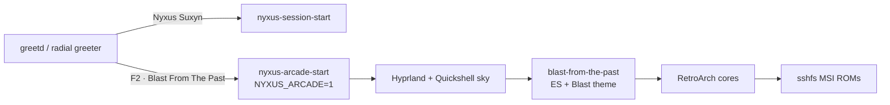

# BLAST FROM THE PAST — cabinet build plan

Nyxus is the organism. Arcade is a **session** of the same compositor, not a
second desktop cloned from Batocera, and not a Fire Stick.

Status: Phase 1 is wired on this machine. Phases 2–6 are the dedicated build.

## What it is

| Layer | Role |
|---|---|
| Hyprland | The cabinet. HDMI = TV. Laptop panel = operator (Nyxus session). |
| Quickshell | Starlight + magma world + living swirls. No bar / Start / widgets in arcade. |
| EmulationStation + Blast theme | Game wheel (the look the Pi never drew). Phase 2 replaces this with a QS wheel. |
| RetroArch | Cores. Library is **mounted**, never copied. |
| MSI `~/GDrive/Games/ROMs` | 734 GB over sshfs → `~/Games/roms`. |
| Midnight Society | Separate **browser** cabinet for official YouTube. Watch, don't rip. |

Login: greeter → **Nyxus Suxyn** (desktop) or **Blast From The Past** (arcade).

Arcade sets `NYXUS_ARCADE=1`. The shell hides Start, rail, widgets, bar, frost.
Autostart launches the wheel on the TV. Super+Escape ends the session.



## What it is not

- Not a Fire Stick. Android TV cannot run Hyprland/Quickshell.
- Not a Pi Zero 2 W cabinet. That board is a kiosk, not this UI.
- Not a pirate “every ROM” installer. Point at games you already have.
- Not yt-dlp of copyrighted shows. Official channels, watch in the browser.

## Tonight (Phase 1) — done on this box

- [x] `nyxus-arcade-start` + `/usr/share/wayland-sessions/nyxus-arcade.desktop`
- [x] `Prefs.arcadeMode` strips Nyxus chrome (bar, Start, rail, widgets, frost)
- [x] HDMI bar off; ES on Vizio at the TV's real geometry (not hardcoded 1920,0)
- [x] Radial greeter can **pick** the session: **F2**, **Ctrl+Tab**, or click the
      right-hand name on the login card. Last session is remembered.
- [x] Super+Escape ends the arcade session back to the greeter
- [x] Library mount from `~/.config/nyxus/arcade-library.conf` (sshfs → MSI)
- [ ] **You:** log out, F2 until the card says BLAST, log in, confirm the TV
      comes up with sky + wheel and no Nyxus bar

Key files (shipped):

| Path | Role |
|---|---|
| `iso-builder/.../nyxus-arcade-start` | Sets `NYXUS_ARCADE=1`, execs the normal session |
| `iso-builder/.../nyxus-arcade-autostart` | Hypr exec-once; no-op unless arcade |
| `iso-builder/.../blast-from-the-past` | Mount library, place ES on HDMI |
| `iso-builder/.../wayland-sessions/nyxus-arcade.desktop` | Greeter entry |
| `hypr/conf.d/nyxus-arcade.conf` | Window rules + Super+Escape + autostart |
| `quickshell/Prefs.qml` `arcadeMode` | Chrome gate |
| `~/.config/nyxus/arcade-library.conf` | This machine's MSI mount (not baked into the ISO) |

## The actual dedicated build

The laptop-to-Vizio night is the prototype. The product is a box that lives
behind the TV, boots straight into Blast, and still *is* Nyxus — same sky,
same magma, same ISO family.

### Phase 2 — Cabinet UI (replace ES)

**Why:** Blast-from-the-past on the Pi went black (SVG/glow/3D wheel). ES is
a borrowed frontend sitting on top of our sky. The look we want is Nyxus
paint *as* the cabinet, not a theme XML inside a foreign window.

**Build:**

1. `quickshell/ArcadeWheel.qml` — system row (NES, SNES, Genesis, PS1, …)
   using Blast PNG art already on disk (`~/.emulationstation/themes/blast-from-the-past/art`).
2. `quickshell/ArcadeCabinet.qml` — game grid/coverflow; gamepad-first.
3. `quickshell/arcade-io.py` — scan `~/Games/roms/<System>/`, launch
   `retroarch -L <core> <rom>`.
4. Keep ES as fallback (`blast-from-the-past --es`) until the wheel is
   family-ready. Autostart prefers QS wheel when `ArcadeCabinet.qml` exists.

**Acceptance:** HDMI shows magma + stars + a wheel. A controller opens a
game. Select+Start returns to the wheel. No Nyxus bar. Super+Escape still
logs out.

**Not in this phase:** rewriting Blast art, PS2 perfection, scraping boxes
from the internet.

### Phase 3 — Library

- sshfs/NFS from MSI stays the source of truth (734 GB stays put).
- Optional local cache of *played* titles only (`~/.cache/nyxus/arcade-played/`).
- Generate `es_systems.cfg` / QS system list from a scan + a core map. Stop
  hardcoding `/home/gowski/Games/roms/...`.
- BIOS for PS1/PS2 is the user's own dumps in `~/Games/bios`. No download pack.
- A title with no matching core is listed but grey — never silently skipped.

**Acceptance:** unplug LAN → wheel still lists cached played games; plug LAN
→ full library returns. A new folder on the MSI shows up after a rescan,
no config edit.

### Phase 4 — Input, TV, audio

- Gamepad is primary. Keyboard is operator (laptop) only.
- HDMI audio default when HDMI is connected.
- 4K TV forced to 1920×1080@60 (already: UI at 4K was unreadably small).
- Lid closed does not sleep while HDMI is live (`HandleLidSwitch=ignore` when
  docked — logind drop-in, arcade session only).
- hypridle already killed in arcade autostart; confirm the TV does not go
  black from DPMS.
- Optional later: HDMI-CEC power-on / volume. Not a blocker.

**Acceptance:** controller-only play on the Vizio with the lid shut. Volume
keys / pad affect the TV speakers.

### Phase 5 — Dedicated box

Target, in order of “this UI will actually run”:

| Box | Verdict |
|---|---|
| Mini PC (Intel N100 / AMD 7735HS class) behind the TV | **The living-room target** |
| Steam Deck / Legion Go, docked | Pocket + TV. Realistic. |
| Pi 5 (8 GB) | Possible for QS wheel + 2D/PS1. PS2 is a maybe. |
| Pi Zero 2 W | No. Kiosk / Midnight Society only. |
| Fire Stick | No. Android, not Hyprland. |

Install path: Nyxus ISO → pick Blast at the greeter, or a first-boot toggle
“this machine is a cabinet.” Point `arcade-library.conf` at the NAS/MSI.

USB of the *session* is the portable form. USB of the ROM library is a
separate decision (copy is 734 GB; prefer keep-on-MSI + network).

### Phase 6 — Portable ISO

Same bake as Nyxus (`iso-builder/build-iso.sh`). Arcade session files already
stage into airootfs.

Still to add, as **optional** packages (not a second ISO unless size blows up):

- `retroarch` + a small core set (NES/SNES/GB/GBA/Genesis/PS1)
- `sshfs`
- EmulationStation only while Phase 2 is unfinished (AUR — bake hook or skip
  and use the QS wheel)

Hard rules, unchanged: no baker hostname, no `gowski`, no ROM files, no
NVIDIA-only GPU env, generic `monitor = , preferred, auto, 1`.

**Acceptance:** stick boots on an unknown HDMI PC, greeter offers both
sessions, Blast shows sky + empty wheel until a library is mounted.

### Phase 7 — Shows (Midnight Society)

A “Shows” row on the wheel that opens the existing ToonCabinet /
official-channel kiosk. YouTube stays watch-in-browser.

No yt-dlp of Bluey, Ms. Rachel, or anything else that is not yours to copy.
Tablet apps were apps. The Pi Zero can run this kiosk; it cannot run this DE.

## Hardware (family night → dedicated)

| Box | Role | When |
|---|---|---|
| Alienware + real HDMI → Vizio | Dev and family night | Now |
| Mini PC behind the TV | Dedicated cabinet | After Phase 2 is fun |
| USB ISO | Take Nyxus+Arcade to another house | Phase 6 |
| Steam Deck docked | Pocket | Optional |
| Fire Stick | — | Never |

## Keybinds

| Chord | Action |
|---|---|
| F2 / Ctrl+Tab (greeter) | Cycle Nyxus Suxyn ↔ Blast From The Past |
| Super+Escape | End arcade session → greeter |
| Start / A | Open game |
| Select+Start | Quit game to wheel |

## Legal

- ROMs and BIOS: dumps of media the family owns, already on the MSI. We mount.
- Shows: official YouTube / official apps. No rip pipeline.
- Blast theme: already on this machine from the Pi work; ship art we have
  rights to. Do not scrape Box.com / random “ROM site” box art.

## First-of-its-kind claim (honest)

Frontends exist (Batocera, ES-DE, Pegasus). What does not: **Hyprland +
Quickshell as the arcade** — living sky and magma as the cabinet glass, same
DE as the daily driver, session-switchable, ISO-portable.

## Open questions (do not silently pick)

1. **Wheel now or later?** Phase 2 (QS wheel) is the real product. ES is the
   working prototype. Next build session should start Phase 2 unless you want
   the mini-PC shopped first.
2. **Dedicated box:** mini PC vs Deck vs wait. Pi 5 only if we drop PS2.
3. **ISO cores:** bake RetroArch on the stick, or install after?
4. **Shows on the same wheel** or keep Midnight Society as its own kiosk?

## Suggested order of work

```
Phase 1  session          ← you are here (logout test remaining)
Phase 2  QS wheel         ← first real build session
Phase 4  lid / audio / pad   can overlap with 2
Phase 3  library scan/cache  after the wheel can launch a game
Phase 7  Shows row           whenever the kiosk is enough
Phase 5  dedicated box       after the wheel is fun on this TV
Phase 6  ISO extras          when 2+3 are stable
```
